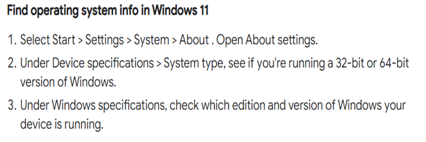
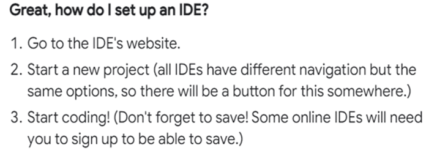

# Dev_Setup
Setup Development Environment

#Assignment: Setting Up Your Developer Environment

#Objective:
This assignment aims to familiarize you with the tools and configurations necessary to set up an efficient developer environment for software engineering projects. Completing this assignment will give you the skills required to set up a robust and productive workspace conducive to coding, debugging, version control, and collaboration.

#Tasks:

1. Select Your Operating System (OS):
   Choose an operating system that best suits your preferences and project requirements. Download and Install Windows 11. https://www.microsoft.com/software-download/windows11

   

2. Install a Text Editor or Integrated Development Environment (IDE):
   Select and install a text editor or IDE suitable for your programming languages and workflow. Download and Install Visual Studio Code. https://code.visualstudio.com/Download

3. Set Up Version Control System:
   Install Git and configure it on your local machine. Create a GitHub account for hosting your repositories. Initialize a Git repository for your project and make your first commit. https://github.com

  Set up Version Control: Install Git from the official website (https://github.com). Create a GitHub account and initialize a Git repository for your project. Make your first commit!

 Install Git:
- Download and install Git from the official website (https://github.com)
 Create a GitHub account:
 - Go to GitHub (https://github.com)
 Initialize a Git repository:
- Create a new folder for your project
- Open a terminal or command prompt in that folder
- Run the command git init to initialize a Git repository
 Make your first commit:
- Add your files to the repository using git add .
- Commit your changes with a meaningful message using git commit -m "Initial commit"
 Link your repository to GitHub:
- Create a new repository on GitHub
- Follow the instructions to link your local repository to the GitHub repository
- Push your changes to the remote repository using git push -u origin master

4. Install Necessary Programming Languages and Runtimes:
  Instal Python from http://wwww.python.org programming language required for your project and install their respective compilers, interpreters, or runtimes. Ensure you have the necessary tools to build and execute your code.

  Install Programming Languages and Runtimes: Install Python from (link unavailable). Ensure you have the necessary tools to build and execute your code.

-Go to the official Python download page (http://wwww.python.org/) and select version (Python) for your project.
 - Choose the correct installer for your operating system (Windows, macOS, or Linux).
 -Run the installer and follow the prompts to install Python.
 - Make sure to select the option to add Python to your PATH during the installation process. This will allow you to run Python from the command line.
 - Once installed, open a terminal or command prompt and type python --version to verify that Python has been successfully installed.
 - Install a Python package manager, such as pip, by running python -m ensurepip in your terminal.
 - Install any additional packages required for your project using pip. For example, you can install the popular requests library by running pip install requests.
 

5. Install Package Managers:
   If applicable, install package managers like pip (Python).

 - Open a command prompt or terminal:
 - On Windows, press Win + R to open the Run dialog, type cmd, then press Enter.
 - On macOS or Linux, use Spotlight search or navigate to Applications > Utilities > Terminal.
 - Type the following command and press Enter: python -m ensurepip

    This command checks if pip is installed and installs it if necessary.
-Once the installation is complete, verify that pip is working by running: pip --version
-This should display the version of pip installed on your system.
With pip installed, you can now easily install packages for your Python projects using the pip          
- install command: pip install request

6. Configure a Database (MySQL):
   Download and install MySQL database. https://dev.mysql.com/downloads/windows/installer/5.7.html

   Download and install MySQL database.
 - Download the MySQL Community Server from the official MySQL website (https://dev.mysql.com/downloads/windows/installer/5.7.html)
- Choose the appropriate version for your operating system Windows, macOS, or Linux.
- Follow the installation instructions to install MySQL on your computer.
- During the installation process, you will be prompted to set a root password for the MySQL server. Choose a strong password and make sure to remember it.
- Once the installation is complete, open a command prompt or terminal and navigate to the bin directory of your MySQL installation (C:\Program Files\MySQL\MySQL Server 8.0\bin on Windows).
- Log in to the MySQL server using the following command: mysql -u root -p<your_root_password>

7. Set Up Development Environments and Virtualization (Optional):
   Consider using virtualization tools like Docker or virtual machines to isolate project dependencies and ensure consistent environments across different machines.

 - Isolate your development environment from your local machine
 - Ensure consistency and reproducibility across different environments
 - Easily switch between different projects or environments
 - Use specific versions of dependencies or tools without affecting your local machine

8. Explore Extensions and Plugins:
   Explore available extensions, plugins, and add-ons for your chosen text editor or IDE to enhance functionality, such as syntax highlighting, linting, code formatting, and version control integration.

-Install Docker or a virtual machine software on your local machine
 -Create a new container or virtual machine for your project
 -Configure the environment as needed ( install dependencies, set environment variables)
 -Develop and test your application within the virtualized environment
 -Easily switch between different environments or projects by creating new containers or virtual machines 

This are some of the tools you can use to set up environment virtual 
- Docker
- VirtualBox
- VMware

9. Document Your Setup:
    Create a comprehensive document outlining the steps you've taken to set up your developer environment. Include any configurations, customizations, or troubleshooting steps encountered during the process. 

Documenting your setup is essential for several reasons:

- Knowledge retention: By writing down the steps you've taken, you'll retain the knowledge and avoid forgetting crucial details.
- Reproducibility: Your documentation will allow you to reproduce the setup in case you need to recreate the environment or troubleshoot  issues.
- Collaboration: If you're working in a team, documentation helps your colleagues understand the setup and make changes or updates.
- Future reference: You'll have a valuable resource for future projects or when upgrading your setup.

Include the following in your documentation:

-Software versions: List the versions of the software, tools, and libraries you've installed.
-Configurations: Document any custom configurations, such as environment variables, settings, or tweaks.
-Customizations: Note any custom scripts, plugins, or modifications you've made.
-Troubleshooting steps: Record any issues you encountered and the steps you took to resolve them.
-Tips and tricks: Add any useful tips or workarounds you discovered during the setup process.

Use a clear and concise format, such as a Markdown file or a wiki page, and store it in a safe place, like a version control repository or a cloud storage service.

#Deliverables:
- Document detailing the setup process with step-by-step instructions and screenshots where necessary.
- A GitHub repository containing a sample project initialized with Git and any necessary configuration files (e.g., .gitignore).
- A reflection on the challenges faced during setup and strategies employed to overcome them.

#Submission:
Submit your document and GitHub repository link through the designated platform or email to the instructor by the specified deadline.

#Evaluation Criteria:**
- Completeness and accuracy of setup documentation.
- Effectiveness of version control implementation.
- Appropriateness of tools selected for the project requirements.
- Clarity of reflection on challenges and solutions encountered.
- Adherence to submission guidelines and deadlines.

Note: Feel free to reach out for clarification or assistance with any aspect of the assignment.
